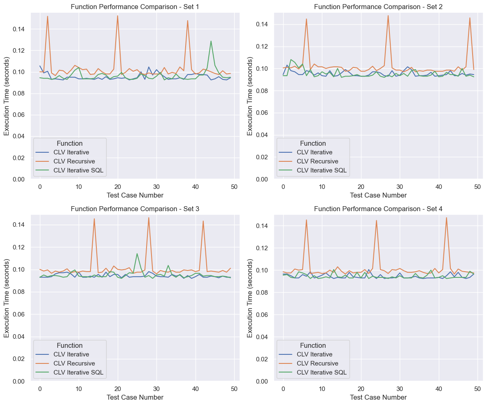

# Introduction
For Task 2, we have developed two distinct methods to calculate **Customer Lifetime Value** (CLV), a concept previously introduced in MKT 656. CLV is a crucial metric that estimates the total net earnings a business can expect from a single customer account throughout their relationship with the company. This metric is particularly useful in determining the cost of onboarding new prospects, enabling businesses to allocate resources appropriately based on the potential revenue generation of new customers.

CLV is particularly critical in industries with subscription-based models. As more businesses, including SaaS, eCommerce, and others, transition to subscription models, CLV becomes a vital indicator for customer segmentation and resource allocation.

There are numerous methodologies to calculate CLV, and our project adopts one of the simplest approaches, which will be detailed in the methodology section. A key feature of our approach is its direct integration with a SQL database. Unlike previous courses where we primarily worked with flat files, real-world applications often provide direct database access. This enables the potential to create data pipelines and integrate our functions across different parts of the production stack. 


# Methodology 
This section details our CLV derivation and code related to the implementation.

## CLV Derivation

In order to calculate CLV, we will carry out the following calculations:

**Profit Per Order**: This is calculated as the average net profit for each transaction.

$$\text{Profit Per Order} = \frac{\text{Total Profit from a Customer}}{\text{Total Number of Orders by the Customer}}$$

**Average Order Frequency**: This represents the average number of orders a customer places per year. It's calculated by dividing the total number of orders by the lifespan of the customer in years.

$$\text{Avg. Order Frequency} = \frac{\text{Total Number of Orders by the Customer}}{\text{Customer's Lifespan in Years}} $$

To convert the customer's lifespan from days to years:

$$\text{Customer's Lifespan in Years} = \frac{\text{Customer's Lifespan in Days}}{365} $$

**Average Lifespan in Years**: This is the average duration that a customer continues to buy from the business. It is calculated directly by converting the average lifespan from days to years.

$$ \text{Avg. Lifespan in Years} = \frac{\text{Mean Lifespan Days}}{365} $$

**Customer Lifetime Value (CLV)**
Combining the above elements, the CLV for a customer can be calculated as:

$$ \text{CLV} = \text{Avg. Profit Per Order} \times \text{Avg. Order Frequency} \times \text{Avg. Lifespan in Years} $$

Where:

**Average Profit Per Order** is the average net profit each order contributes.

**Average Order Frequency** is how often a customer places an order in a year.

**Average Lifespan in Years** is the average number of years a customer continues to engage with the business.

$$ \text{CLV} = \text{Mean Profit Per Order} \times \left( \frac{\text{Mean Order Amount}}{\text{Mean Lifespan Days} / 365} \right) \times \left( \frac{\text{Mean Lifespan Days}}{365} \right) $$

## Programming

Our program follows a simple function design and we adhered to the practice of one function does one thing. Below is the design flow chart:


This document will not detail the `SQL` or helper DB API functions. If you wish to see details related to them, see their source code here: ([GitHub](https://github.com/Musiik-fn/622-Final-Project/blob/main/Task%202/Task2.py))

---
### Function: `getUniqueCustomers()`
**Description:**  
Generates a list of unique customers from the `sales_data` table in the database. Opens a connection to DB, stores DB table into a Pandas `DataFrame`, then fetches the unique customers using Pandas `.unique()`. 

**Arguments:**  
None

**Returns:**  
- `list`: List of unique customers from the sales database table.

```Python
def getUniqueCustomers():
    conn, cursor = initializeDatabaseConnection()
    data = pd.read_sql_query('SELECT * FROM sales_data', con=conn)
    conn.close()
    return data['CUSTOMERNAME'].unique().tolist()
```
---

### Function: `getMetricsIterative()`
**Description:**  
Calculates average quantities of orders, lifespan, total profit, and profit margin for each unique customer in the sales database. A list of unqiue customers is ititialized using the function above. Opens a connection to the DB, stores the DB table into a Pandas `DataFrame`. Field `ORDERDATE` is switched to a Pandas `DateTime`. 

The function iterates through each customer in the `customerList` with a `for` loop. This loop calculates the amount of orders, the lifespan of the customer, the total amount of profit they have generated, and their profit margin. Each customer's results are stored into a `dict`, then we use NumPy to find the mean of each numerical field.

**Arguments:**  
None

**Returns:**  
- `dict`: Dictionary containing `meanOrderAmount`, `meanLifespanDays`, `meanTotalProfit`, and `meanProfitMargin`.

```Python
def getMetricsIterative():
    customerList = getUniqueCustomers()
    conn, cursor = initializeDatabaseConnection()
    data = pd.read_sql_query('SELECT * FROM sales_data', con=conn)
    data['ORDERDATE'] = pd.to_datetime(data['ORDERDATE'])
    conn.close()

    results = {}
    for eachCustomer in customerList:
        customer_data = data[data['CUSTOMERNAME'] == eachCustomer].copy()
        orderAmount = customer_data.shape[0]
        lifespan_days = (customer_data['ORDERDATE'].max() - customer_data['ORDERDATE'].min()).days
        total_profit = (customer_data['SALES'] - (customer_data['MSRP'] * customer_data['QUANTITYORDERED'])).sum()
        
        if orderAmount > 0:
            profit_per_order = total_profit / orderAmount
            customer_data['MARGIN'] = (customer_data['SALES'] - (customer_data['MSRP'] * customer_data['QUANTITYORDERED'])) / customer_data['SALES']
            profitMargin = customer_data['MARGIN'].mean()
        else:
            profit_per_order = 0
            profitMargin = 0  
        
        results[eachCustomer] = {
            'orderAmount': orderAmount,
            'lifespanDays': lifespan_days,
            'totalProfit': total_profit,
            'profitMargin': profitMargin,
            'profitPerOrder': profit_per_order
        }

    mean_metrics = {
        'meanOrderAmount': np.mean([item['orderAmount'] for item in results.values()]),
        'meanLifespanDays': np.mean([item['lifespanDays'] for item in results.values()]),
        'meanTotalProfit': np.mean([item['totalProfit'] for item in results.values()]),
        'meanProfitMargin': np.mean([item['profitMargin'] for item in results.values()]),
        'meanProfitPerOrder': np.mean([item['profitPerOrder'] for item in results.values()])
    }
    return mean_metrics

```
---

### Function: `getCLV_Iterative()`
**Description:**  
Calculates the Customer Lifetime Value (CLV) using average metrics calculated from the entire sales database. A simple product per our definition of CLV above.

**Arguments:**  
None

**Returns:**  
- `float`: Customer Lifetime Value.

```Python
def getCLV_Iterative():
    metrics = getMetricsIterative()
    avg_profit_per_order = metrics['meanProfitPerOrder']
    avg_order_frequency = metrics['meanOrderAmount'] / (metrics['meanLifespanDays'] / 365)  # convert lifespan to years
    avg_lifespan_years = metrics['meanLifespanDays'] / 365

    clv = avg_profit_per_order * avg_order_frequency * avg_lifespan_years
    return clv
```

---

### Function: `getMetricsRecursive(data, customerList, index=0, results=None)`
**Description:**  
Recursively calculates sales metrics such as average order quantities, lifespan, total profit, and profit margin. This function processes customers one at a time recursively, accumulating results. This function, unlike it's iterative counterpart, has some arguments. These arguments are essential in the iterative function because we will increment our `index` after each recursive call, and that `index` points to which customer to calculate metrics for within the `customerList`. 

Our base case is when the `index` value is equal to or greater than the length of the `customerList`. At this point, we have the program calculuate the aggregate means similar to the iterative function. 

**Arguments:**  
- `data` (`DataFrame`): Customer sales data table.
- `customerList` (`list`): List of unique customers, obtained from `getUniqueCustomers()`.
- `index` (`int`, optional): Current index in customer list. Default is 0.
- `results` (`dict`, optional): Stores intermediate results. Default is None.

**Returns:**  
- `dict`: Dictionary containing `meanOrderAmount`, `meanLifespanDays`, `meanTotalProfit`, and `meanProfitMargin`.

```Python
def getMetricsRecursive(data, customerList, index=0, results=None):
    """Using recursive methods, calculates the following sales metrics: average quantities of orders, average life span, average total profit, average profit margin.

    Args:
        data (`DataFrame`): The customer sales data table, in the d type of `DataFrame`
        customerList (`list`): The unique list of customers. This list will be filled with the `getUniqueCustomer()` function.
        index (int, optional): Tracks if the function has iterated through the customer list. Should not be changed. Defaults to 0.
        results (`dict`, optional): Stores results. Should not be changed. Defaults to None.

    Returns:
        `dict`: Dictionary which contains meanOrderAmount, meanLifespan, meanTotalProfit, and meanProfitMargin
    """
    if results is None:
        results = {}
    if index >= len(customerList): # checks if the recursion has processed all customers. If index is equal to or greater than the length of customerList, it computes the average (mean) of all metrics collected in the results dictionary and returns them.
        mean_metrics = {
            'meanOrderAmount': np.mean([item['orderAmount'] for item in results.values()]),
            'meanLifespanDays': np.mean([item['lifespanDays'] for item in results.values()]),
            'meanTotalProfit': np.mean([item['totalProfit'] for item in results.values()]),
            'meanProfitMargin': np.mean([item['profitMargin'] for item in results.values()]),
            'meanProfitPerOrder': np.mean([item['profitPerOrder'] for item in results.values()])
        }
        return mean_metrics
    else:
        customer_data = data[data['CUSTOMERNAME'] == customerList[index]].copy()
        orderAmount = customer_data.shape[0]
        lifespan_days = (customer_data['ORDERDATE'].max() - customer_data['ORDERDATE'].min()).days
        total_profit = (customer_data['SALES'] - (customer_data['MSRP'] * customer_data['QUANTITYORDERED'])).sum()

        if orderAmount > 0:
            profit_per_order = total_profit / orderAmount
            customer_data['MARGIN'] = (customer_data['SALES'] - (customer_data['MSRP'] * customer_data['QUANTITYORDERED'])) / customer_data['SALES']
            profitMargin = customer_data['MARGIN'].mean()
        else:
            profit_per_order = 0
            profitMargin = 0

        results[customerList[index]] = {
            'orderAmount': orderAmount,
            'lifespanDays': lifespan_days,
            'totalProfit': total_profit,
            'profitMargin': profitMargin,
            'profitPerOrder': profit_per_order
        }

        return getMetricsRecursive(data, customerList, index + 1, results)
```
---

### Function: `getCLV_Recursive(metrics)`
**Description:**  
Calculates the Customer Lifetime Value (CLV) using metrics provided, processed recursively.

**Arguments:**  
- `metrics` (`dict`): Metrics dictionary containing average sales data metrics.

**Returns:**  
- `float`: Customer Lifetime Value.

```Python
def getCLV_Recursive(metrics):
    avg_profit_per_order = metrics['meanProfitPerOrder']
    avg_order_frequency = metrics['meanOrderAmount'] / (metrics['meanLifespanDays'] / 365)
    avg_lifespan_years = metrics['meanLifespanDays'] / 365

    return avg_profit_per_order * avg_order_frequency * avg_lifespan_years
```
---
Both versions of the code above produce the same results:
```Python
Recursive CLV: 441.03293932693344     
Iterative CLV: 441.03293932693344
```


# Results 
Remark: The code related to the performance analysis can be found here: ([GitHub](https://github.com/Musiik-fn/622-Final-Project/blob/main/Task%202/Task2Performance.ipynb))

The execution time of our functions are visualized here:


The spiking behavior likely is related to a certain point in the recursive stack once a certain number of customers have been recursed through.


# Discussion 
For a program like this, recursion is not necessarily a good solution. Recursion is great at repetitive operations in which the present part of a sequence depends on a previous one. This operation is iterative in nature, we simply caclulate by continuous grouping arithmetic, and aggregations.

However, we do believe the recursion would be useful in the CLV formula with retention rates and/or churn rates. Because customer loyalty tends to decrease over time, retention rates are used in the some applications of CLV. This rate represents the probability that a customer will continue to purchase within a period, and therefore, the summation for CLV becomes slightly more complicated. 


# Conclusion 
Conclude with your recommendation on which version to use and under what circumstances.

