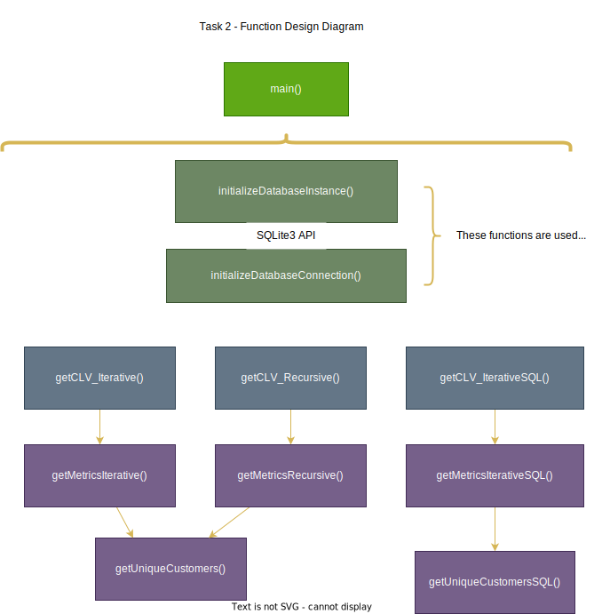

# Introduction
For Task 2, we have developed two distinct methods to calculate **Customer Lifetime Value** (CLV), a concept previously introduced in MKT 656. CLV is a crucial metric that estimates the total net earnings a business can expect from a single customer account throughout their relationship with the company. This metric is particularly useful in determining the cost of onboarding new prospects, enabling businesses to allocate resources appropriately based on the potential revenue generation of new customers.

CLV is particularly critical in industries with subscription-based models. As more businesses, including SaaS, eCommerce, and others, transition to subscription models, CLV becomes a vital indicator for customer segmentation and resource allocation.

There are numerous methodologies to calculate CLV, and our project adopts one of the simplest approaches, which will be detailed in the methodology section. A key feature of our approach is its direct integration with a SQL database. Unlike previous courses where we primarily worked with flat files, real-world applications often provide direct database access. This enables the potential to create data pipelines and integrate our functions across different parts of the production stack. 

# Methodology 
This section details our CLV derivation and code related to the implementation.

## CLV Derivation

In order to calculate CLV, we will carry out the following calculations:

**Profit Per Order**: This is calculated as the average net profit for each transaction.

$$\text{Profit Per Order} = \frac{\text{Total Profit from a Customer}}{\text{Total Number of Orders by the Customer}}$$

**Average Order Frequency**: This represents the average number of orders a customer places per year. It's calculated by dividing the total number of orders by the lifespan of the customer in years.

$$\text{Avg. Order Frequency} = \frac{\text{Total Number of Orders by the Customer}}{\text{Customer's Lifespan in Years}} $$

To convert the customer's lifespan from days to years:

$$\text{Customer's Lifespan in Years} = \frac{\text{Customer's Lifespan in Days}}{365} $$

**Average Lifespan in Years**: This is the average duration that a customer continues to buy from the business. It is calculated directly by converting the average lifespan from days to years.

$$ \text{Avg. Lifespan in Years} = \frac{\text{Mean Lifespan Days}}{365} $$

**Customer Lifetime Value (CLV)**
Combining the above elements, the CLV for a customer can be calculated as:

$$ \text{CLV} = \text{Avg. Profit Per Order} \times \text{Avg. Order Frequency} \times \text{Avg. Lifespan in Years} $$

Where:

**Average Profit Per Order** is the average net profit each order contributes.

**Average Order Frequency** is how often a customer places an order in a year.

**Average Lifespan in Years** is the average number of years a customer continues to engage with the business.

$$ \text{CLV} = \text{Mean Profit Per Order} \times \left( \frac{\text{Mean Order Amount}}{\text{Mean Lifespan Days} / 365} \right) \times \left( \frac{\text{Mean Lifespan Days}}{365} \right) $$

Our program follows a simple function design and we adhered to the practice of one function does one thing. 

---

### Function: `initializeDatabaseInstance()`
**Description:**  
Initializes an SQLite database instance in the repository, imports data from a CSV file, creates a table named `sales_data`, and fills it with the CSV data.

**Arguments:**  
None

**Returns:**  
None

---

### Function: `initializeDatabaseConnection()`
**Description:**  
Initializes an SQLite connection and cursor to the sales database. User still has to close the database connection after use with `conn.close()`.

**Arguments:**  
None

**Returns:**  
- `conn`: Connection to the database.
- `cursor`: Cursor for database operations.

---

### Function: `getUniqueCustomers()`
**Description:**  
Generates a list of unique customers from the `sales_data` table in the database.

**Arguments:**  
None

**Returns:**  
- `list`: List of unique customers from the sales database table.

---

### Function: `getMetricsIterative()`
**Description:**  
Calculates average quantities of orders, lifespan, total profit, and profit margin for each unique customer in the sales database.

**Arguments:**  
None

**Returns:**  
- `dict`: Dictionary containing `meanOrderAmount`, `meanLifespanDays`, `meanTotalProfit`, and `meanProfitMargin`.

---

### Function: `getCLV_Iterative()`
**Description:**  
Calculates the Customer Lifetime Value (CLV) using average metrics calculated from the entire sales database.

**Arguments:**  
None

**Returns:**  
- `float`: Customer Lifetime Value.

---

### Function: `getMetricsRecursive(data, customerList, index=0, results=None)`
**Description:**  
Recursively calculates sales metrics such as average order quantities, lifespan, total profit, and profit margin. This function processes customers one at a time recursively, accumulating results.

**Arguments:**  
- `data` (`DataFrame`): Customer sales data table.
- `customerList` (`list`): List of unique customers, obtained from `getUniqueCustomers()`.
- `index` (`int`, optional): Current index in customer list. Default is 0.
- `results` (`dict`, optional): Stores intermediate results. Default is None.

**Returns:**  
- `dict`: Dictionary containing `meanOrderAmount`, `meanLifespanDays`, `meanTotalProfit`, and `meanProfitMargin`.

---

### Function: `getCLV_Recursive(metrics)`
**Description:**  
Calculates the Customer Lifetime Value (CLV) using metrics provided, processed recursively.

**Arguments:**  
- `metrics` (`dict`): Metrics dictionary containing average sales data metrics.

**Returns:**  
- `float`: Customer Lifetime Value.

---

### Function: `getUniqueCustomersSQL()`
**Description:**  
Fetches a distinct list of customer names directly from the SQL database using a DISTINCT query.

**Arguments:**  
None

**Returns:**  
- `list`: List of unique customer names from the sales database.

---

### Function: `getMetricsIterativeSQL()`
**Description:**  
Directly computes sales metrics using SQL queries to perform aggregation functions. This method utilizes SQL to calculate and return average order amounts, lifespan days, total profit, and profit margins for each customer.

**Arguments:**  
None

**Returns:**  
- `dict`: Dictionary containing average values of order amounts, lifespan days, total profit, and profit margins.

---

### Function: `getCLV_IterativeSQL()`
**Description:**  
Calculates the Customer Lifetime Value (CLV) using aggregated metrics obtained directly from SQL queries

**Arguments:**  
None

**Returns:**  
- `float`: Customer Lifetime Value.

---

# Results 
Present the outcomes of the performance analysis.

# Discussion 
Offer insights into the benefits and limitations of each implementation style.

# Conclusion 
Conclude with your recommendation on which version to use and under what circumstances.

